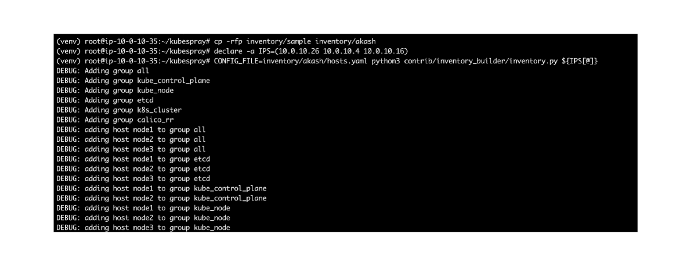
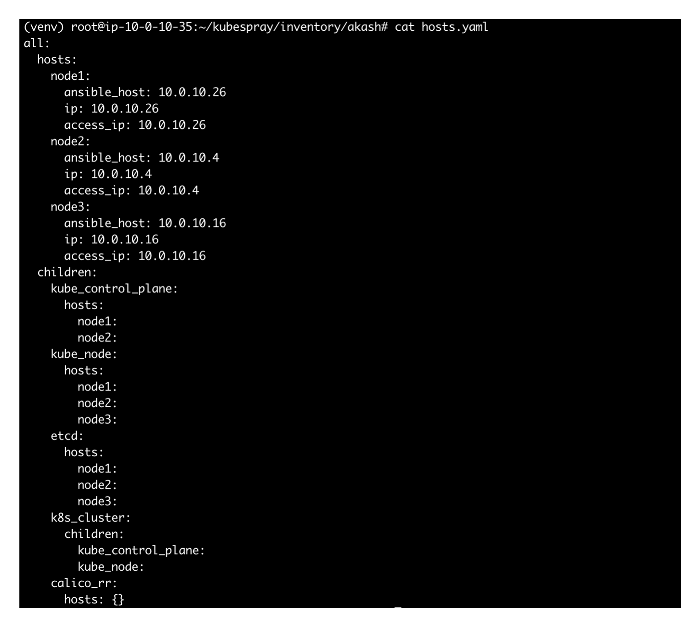
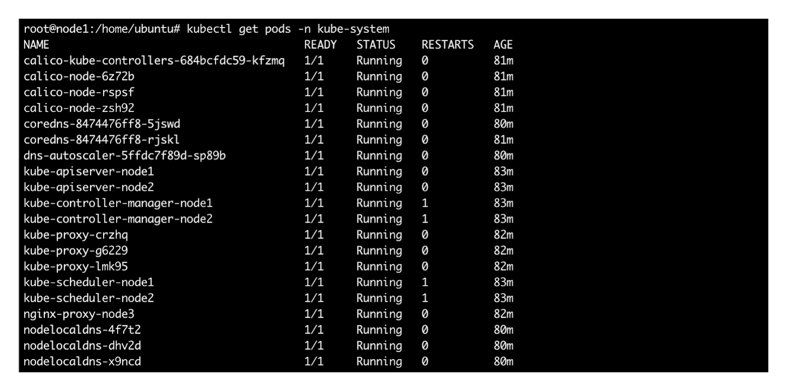
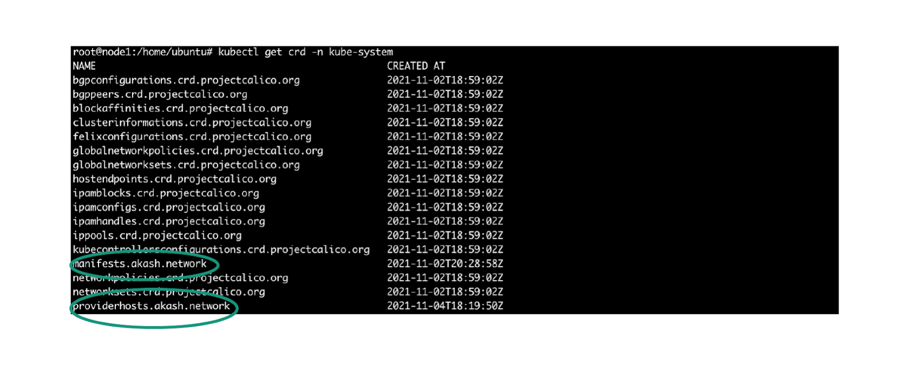

# Kubernetes Cluster

## **Kubernetes Cluster Setup for Akash Providers**

### **Overview**

Akash leases are deployed via Kubernetes pods on provider clusters. This guide details the build of the provider’s Kubernetes control plane and worker nodes.

The setup of a Kubernetes cluster is the responsibility of the provider. This guide provides best practices and recommendations for setting up a Kubernetes cluster. This document is not a comprehensive guide and assumes pre-existing Kubernetes knowledge.

### STEP1 - Clone the Kubespray Project

_**Cluster Creation Recommendations**_

We recommend using the Kubespray project to deploy a cluster. Kubespray uses Ansible to make the deployment of a Kubernetes cluster easy.&#x20;

The recommended minimum number of hosts is three. This is meant to allow:

* One host to serve as Kubernetes master node & Akash provider&#x20;
* One host to serve as a redundant master node&#x20;
* One host to serve as Kubernetes worker node to host provider leases

In testing and dev a single host Kubernetes cluster could be used but this configuration is not recommended for production.

_**Kubespray Clone**_

Install Kubespray on a machine that has connectivity to the three hosts that will serve as the Kubernetes cluster.

_Obtain Kubespray and navigate into the created local directory_

```
git clone https://github.com/kubernetes-sigs/kubespray.git

cd kubespray
```

### STEP2 - Install Ansible

When launched Kubespray will use an Ansible playbook to deploy a Kubernetes cluster. In this step we will install Ansible.

Depending on your operating system it may be necessary to install OS patches, pip3, and virtualenv. Example steps for a Ubuntu OS are detailed below.

```
sudo apt-get update

sudo apt-get install -y python3-pip

sudo apt install virtualenv
```

Within the kubespray directory use the following commands for the purpose of:

* Opening a Python virtual environment for the Ansible install&#x20;
* Installing Ansible and other necessary packages specified in the requirements.txt file

```
virtualenv --python=python3 venv

source venv/bin/activate

pip3 install -r requirements.txt
```

### STEP3 - Ansible Access to Kubernetes Cluster

Ansible will configure the Kubernetes hosts via SSH. The user Ansible connects with must be root or have the capability of escalating privileges to root.

Commands in this step provide an example set up of SSH access to Kubernetes hosts and testing those connections.

_**Create SSH Keys on Ansible Host**_

```
ssh-keygen
```

* Accept the defaults to create a public-private key pair&#x20;
* The keys will be stored in the user’s home directory.
* Example of files created:


_**Copy Public Key to the Kubernetes Hosts**_

```
ssh-copy-id -i ~/.ssh/id_rsa <username>@<ip-address>
```

_**Confirm SSH to the Kubernetes Hosts**_

* Ansible should be able to access Kubernetes hosts with no password

```
ssh -i ~/.ssh/id_rsa <username>@<ip-address>
```

_**Example**_

* Complete example SSH setup from Ansible host to all Kubernetes hosts


### STEP4 - Ansible Inventory

Ansible will use an inventory file to determine the hosts Kubernetes should be installed on.

_**Inventory File**_

* Use the following commands on the Ansible host and in the “kubespray” directory&#x20;
* Replace the IP addresses in the declare command with the addresses of your Kubernetes hosts&#x20;
* Running these commands will create a hosts.yaml file within the kubespray/inventory/akash directory

```
cp -rfp inventory/sample inventory/akash

declare -a IPS=(10.0.10.27 10.0.10.113 10.0.10.132)

CONFIG_FILE=inventory/akash/hosts.yaml python3 contrib/inventory_builder/inventory.py ${IPS[@]}
```

_Expected result_



_Example of the generated hosts.yaml File_



### STEP5 - Enable gVisor

In this section we will enable gVisor which provides basic container security.

* From the “kubespray” directory:

```
cd inventory/akash/group_vars/k8s_cluster
```

* Using VI or nano edit the k8s-cluster.yml file:

```
vi k8s-cluster.yml
```

* Update the container\_manager key

```
container_manager: containerd
```

* From  the “kubespray” directory:

```
cd inventory/akash/group_vars
```

* Using VI or nano edit the etcd.yml file:

```
vi etcd.yml
```

* Update the etcd\_deployment\_type key

```
etcd_deployment_type: host
```

### STEP6 - Create Kubernetes Cluster

With inventory in place we are ready to build the Kubernetes cluster via Ansible.

* Note - the cluster creation may take several minutes to complete&#x20;
* From the “kubespray” directory:

```
ansible-playbook -i inventory/akash/hosts.yaml -b -v --private-key=~/.ssh/id_rsa cluster.yml
```

### STEP7 - Confirm Kubernetes Cluster

A couple of quick Kubernetes cluster checks are in order before moving into next steps.

* SSH into Kubernetes node01 (AKA Kubernetes master node)

_**Confirm Kubernetes Nodes**_

```
kubectl get nodes
```

* Example output from a healthy Kubernetes cluster


_**Confirm Kubernetes Pods**_

```
kubectl get pods -n kube-system
```

* Example output of the pods that are the brains of the cluster



### STEP 8 - Custom Resource Definition

Akash uses two Kubernetes Custom Resource Definitions (CRD) to store each deployment.

* On the Kubernetes master node, download and install the Akash CRD files.

_**Download the First CRD File**_

```
wget https://raw.githubusercontent.com/ovrclk/akash/master/pkg/apis/akash.network/v1/crd.yaml
```

_**Install the First CRD File**_

```
kubectl apply -f ./crd.yaml
```

_**Download the Second CRD File**_

```
wget https://raw.githubusercontent.com/ovrclk/akash/mainnet/main/pkg/apis/akash.network/v1/provider_hosts_crd.yaml
```

_**Install the Second CRD File**_

```
kubectl apply -f ./provider_hosts_crd.yaml
```

_**Confirm the CRD installs**_

```
kubectl get crd -n kube-system
```

_**Expected CRD Output**_



### STEP9 - Network Policy

_**Network Configuration**_

A network configuration which must be applied to the Kubernetes cluster.

* On the Kubernetes master node, download the network YAML file

```
wget https://raw.githubusercontent.com/ovrclk/akash/master/_docs/kustomize/networking/network-policy-default-ns-deny.yaml
```

* Install the YAML File

```
kubectl apply -f ./network-policy-default-ns-deny.yaml
```

### STEP10 - Ingress Controller

The Akash provider requires an ingress controller in the Kubernetes cluster.

_**Ingress Controller Insta**_ll

* On the Kubernetes master node, download the ingress controller YAML file

```
wget https://raw.githubusercontent.com/ovrclk/akash/master/_run/ingress-nginx.yaml
```

* Install the YAML File

```
kubectl apply -f ./ingress-nginx.yaml
```

* Expected result


_**Ingress Controller Configuration**_

A Kubernetes node needs to be labeled for ingress use. This will cause the NGINX ingress controller to live only on the labeled node.

NOTE - if a wildcard domain is created, the pointers should point to the labeled node's IP address. Additional nodes can be labeled to load balance any ingress communications.

```
kubectl label nodes node3 akash.network/role=ingress
```
