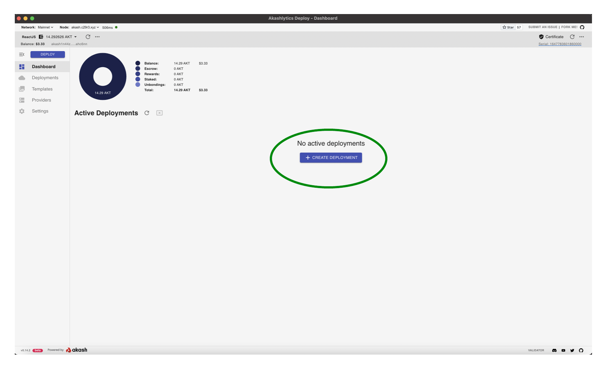
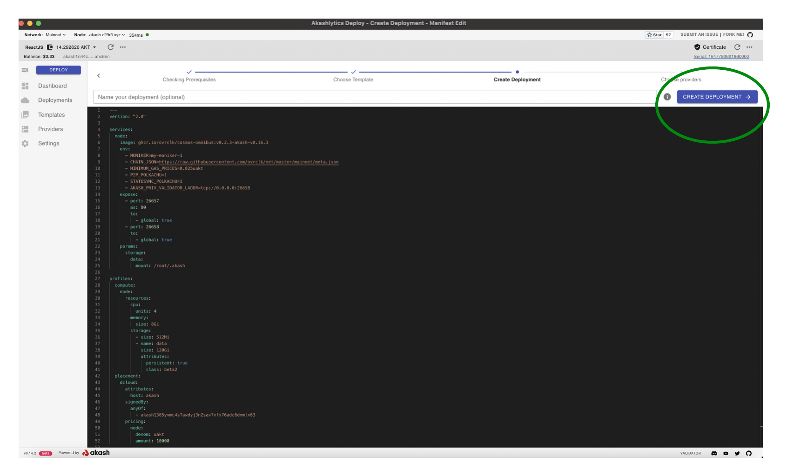
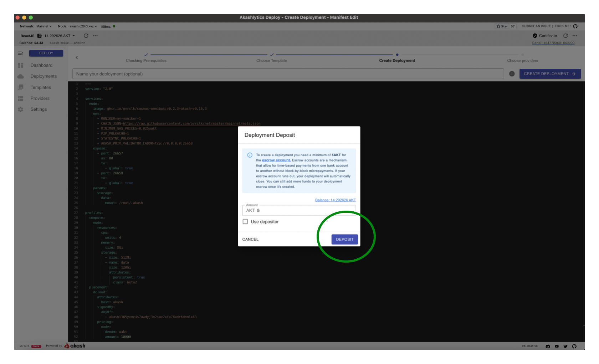
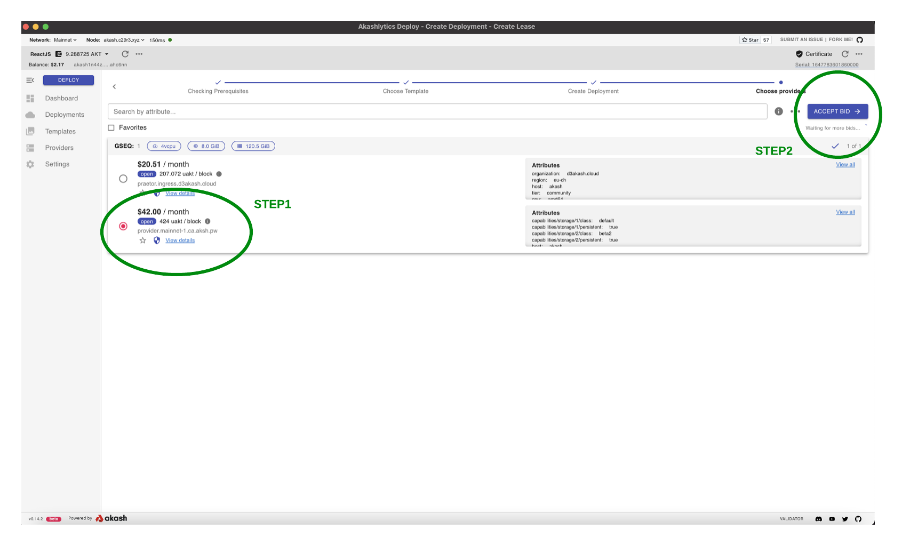
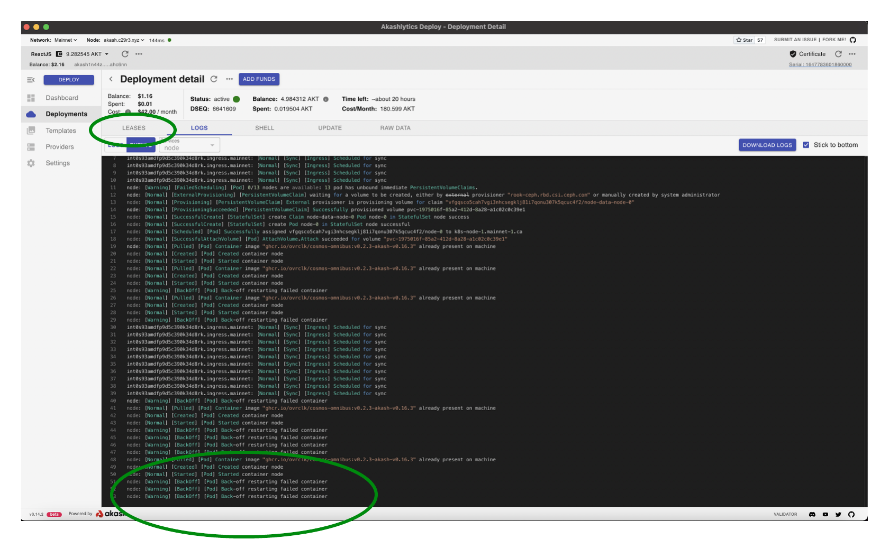

# Akash Validator Deployment

## Akashlytics Deploy

* Within this guide we will use the Akashlytics Deploy application to create the Akash Validator
* Please review our[ Akashlytics Deploy ](../../../../guides/deploy/)docs to install and configuration the application if this is your first time using

## Create the Akash Validator Deployment

* Use the steps that follow - within Akashlytics Deploy - to create your Akash Validator deployment

### Create New Deployment

* Use the `CREATE DEPLOYMENT` button to launch a new deployment



### Empty Template Option

* Select the `Empty` option as we will be copying a pre-constructed Akash SDL for the deployment


### Copy SDL into Editor

* Copy the following Akash SDL into the Editor pane
* Reference the [Populated Editor](akash-validator-deployment.md#populated-editor) section for further clarity
* Select the `CREATE DEPLOYMENT` button to proceed

```
---
version: "2.0"

services:
  node:
    image: ghcr.io/ovrclk/cosmos-omnibus:v0.2.3-akash-v0.16.3
    env:
      - MONIKER=my-moniker-1
      - CHAIN_JSON=https://raw.githubusercontent.com/ovrclk/net/master/mainnet/meta.json
      - MINIMUM_GAS_PRICES=0.025uakt
      - P2P_POLKACHU=1
      - STATESYNC_POLKACHU=1
      - AKASH_PRIV_VALIDATOR_LADDR=tcp://0.0.0.0:26658
    expose:
      - port: 26657
        as: 80
        to:
          - global: true
      - port: 26658
        to:
          - global: true
    params:
      storage:
        data:
          mount: /root/.akash

profiles:
  compute:
    node:
      resources:
        cpu:
          units: 4
        memory:
          size: 8Gi
        storage:
          - size: 512Mi
          - name: data
            size: 120Gi
            attributes:
              persistent: true
              class: beta2
  placement:
    dcloud:
      attributes:
        host: akash
      signedBy:
        anyOf:
          - akash1365yvmc4s7awdyj3n2sav7xfx76adc6dnmlx63
      pricing:
        node:
          denom: uakt
          amount: 10000

deployment:
  node:
    dcloud:
      profile: node
      count: 1
```

#### Populated Editor



### Deployment Deposit

* An escrow account is created for the deployment that is deducted from by the provider for the cost of the workload over time
* By default 5 AKT is specified as the initial escrow deposit
* If a deployment's escrow becomes $0 in the future the lease with the provider will be closed.  Consider increasing the initial deposit to an amount that will be enough to fund the deployment for some time.  And/or consider a strategy to ensure the escrow is re-funded on a periodic basis to ensure no disruption to your validator.
* When ready select `DEPOSIT` to proceed and `APPROVE` any Transaction/gas fee prompts that follow



### Select Akash Provider

* A list of Akash Providers that have bid on your deployment is displayed
* Choose the desired Provider from the list and then select `ACCEPT BID` to proceed



### Deployment Logs

* The `LOGS` pane for the new Deployment will display
* NOTE - after a period of time the logs will display a `Back-off restarting failed container` message.  This is expected as the container will not start until it has established a connection with the TMKMS server in subsequent steps.
* Select the `LEASES` tab to proceed into the next step



### Capture Deployment URI and Port

* In upcoming TMKMS configuration sections we will need to specify our Akash Validator deployment's URI and port
* Capture this info from the `LEASES` tab for later use
* In the example the following values would be captured (these values will be different for your deployment):
  * URI - using the Provider field - `provider.mainnet-1.ca.aksh.pw`
  * Port - using the Forwarded Port field - `31237`


